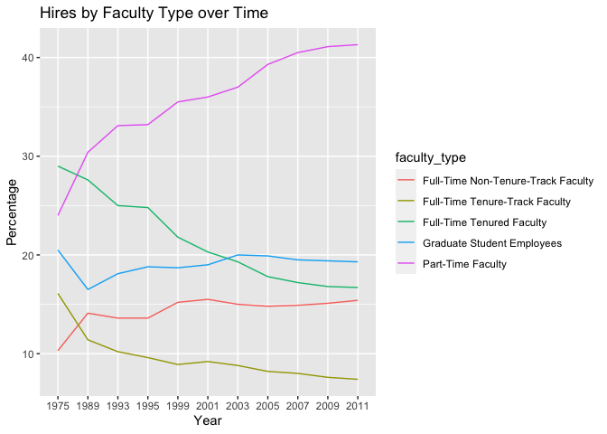

Lab 06 - Ugly charts and Simpson’s paradox
================
Lindsey Wilson
2/16/23

### Load packages and data

``` r
library(tidyverse) 
library(dsbox)
library(mosaicData) 
```

``` r
staff <- read_csv("data/instructional-staff.csv")
```

    ## Rows: 5 Columns: 12
    ## ── Column specification ────────────────────────────────────────────────────────
    ## Delimiter: ","
    ## chr  (1): faculty_type
    ## dbl (11): 1975, 1989, 1993, 1995, 1999, 2001, 2003, 2005, 2007, 2009, 2011
    ## 
    ## ℹ Use `spec()` to retrieve the full column specification for this data.
    ## ℹ Specify the column types or set `show_col_types = FALSE` to quiet this message.

### Instructional Staff Employment Trends

Here’s our code to take the data in `staff` and make it long:

``` r
staff_long <- staff %>%
  pivot_longer(cols = -faculty_type, names_to = "year") %>%
  mutate(value = as.numeric(value))

staff_long
```

    ## # A tibble: 55 × 3
    ##    faculty_type              year  value
    ##    <chr>                     <chr> <dbl>
    ##  1 Full-Time Tenured Faculty 1975   29  
    ##  2 Full-Time Tenured Faculty 1989   27.6
    ##  3 Full-Time Tenured Faculty 1993   25  
    ##  4 Full-Time Tenured Faculty 1995   24.8
    ##  5 Full-Time Tenured Faculty 1999   21.8
    ##  6 Full-Time Tenured Faculty 2001   20.3
    ##  7 Full-Time Tenured Faculty 2003   19.3
    ##  8 Full-Time Tenured Faculty 2005   17.8
    ##  9 Full-Time Tenured Faculty 2007   17.2
    ## 10 Full-Time Tenured Faculty 2009   16.8
    ## # … with 45 more rows

This allows us to plot our data as a line graph:

``` r
staff_long %>%
  ggplot(aes(x = year, y = value, color = faculty_type)) +
  geom_line()
```

    ## `geom_line()`: Each group consists of only one observation.
    ## ℹ Do you need to adjust the group aesthetic?

<!-- -->

However, when we run that code we get an error message. We can fix this
by grouping by `faculty_type` in ggplot:

``` r
staff_long %>%
  ggplot(aes(x = year,
             y = value,
             group = faculty_type,
             color = faculty_type)) +
  geom_line() + 
  labs(title = "Hires by Faculty Type over Time",
       x = "Year",
       y = "Percentage")
```

<!-- -->

If I wanted to show that the percentage of part-time faculty in
particular has gone up, I would probably filter the data just to show
that one group.

### Exercise 1

Remove this text, and add your answer for Exercise 1 here. Add code
chunks as needed. Don’t forget to label your code chunk. Do not use
spaces in code chunk labels.

### Exercise 2

Remove this text, and add your answer for Exercise 1 here. Add code
chunks as needed. Don’t forget to label your code chunk. Do not use
spaces in code chunk labels.

### Exercise 3

…

Add exercise headings as needed.
