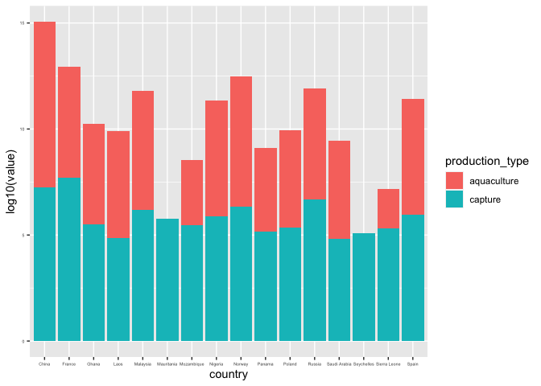

Lab 06 - Ugly charts and Simpson’s paradox
================
Lindsey Wilson
2/16/23

### Load packages and data

``` r
library(tidyverse) 
library(dsbox)
library(mosaicData) 
```

``` r
staff <- read_csv("data/instructional-staff.csv")
```

    ## Rows: 5 Columns: 12
    ## ── Column specification ────────────────────────────────────────────────────────
    ## Delimiter: ","
    ## chr  (1): faculty_type
    ## dbl (11): 1975, 1989, 1993, 1995, 1999, 2001, 2003, 2005, 2007, 2009, 2011
    ## 
    ## ℹ Use `spec()` to retrieve the full column specification for this data.
    ## ℹ Specify the column types or set `show_col_types = FALSE` to quiet this message.

### Instructional Staff Employment Trends

Here’s our code to take the data in `staff` and make it long:

``` r
staff_long <- staff %>%
  pivot_longer(cols = -faculty_type, names_to = "year") %>%
  mutate(value = as.numeric(value))

staff_long
```

    ## # A tibble: 55 × 3
    ##    faculty_type              year  value
    ##    <chr>                     <chr> <dbl>
    ##  1 Full-Time Tenured Faculty 1975   29  
    ##  2 Full-Time Tenured Faculty 1989   27.6
    ##  3 Full-Time Tenured Faculty 1993   25  
    ##  4 Full-Time Tenured Faculty 1995   24.8
    ##  5 Full-Time Tenured Faculty 1999   21.8
    ##  6 Full-Time Tenured Faculty 2001   20.3
    ##  7 Full-Time Tenured Faculty 2003   19.3
    ##  8 Full-Time Tenured Faculty 2005   17.8
    ##  9 Full-Time Tenured Faculty 2007   17.2
    ## 10 Full-Time Tenured Faculty 2009   16.8
    ## # … with 45 more rows

This allows us to plot our data as a line graph:

``` r
staff_long %>%
  ggplot(aes(x = year, y = value, color = faculty_type)) +
  geom_line()
```

    ## `geom_line()`: Each group consists of only one observation.
    ## ℹ Do you need to adjust the group aesthetic?

<!-- -->

However, when we run that code we get an error message. We can fix this
by grouping by `faculty_type` in ggplot:

``` r
staff_long %>%
  ggplot(aes(x = year,
             y = value,
             group = faculty_type,
             color = faculty_type)) +
  geom_line() + 
  labs(title = "Hires by Faculty Type over Time",
       x = "Year",
       y = "Percentage")
```

<!-- -->

If I wanted to show that the percentage of part-time faculty in
particular has gone up, I would probably filter the data just to show
that one group.

### Fisheries

``` r
fisheries <- read_csv("data/fisheries.csv")
```

    ## Rows: 216 Columns: 4
    ## ── Column specification ────────────────────────────────────────────────────────
    ## Delimiter: ","
    ## chr (1): country
    ## dbl (3): capture, aquaculture, total
    ## 
    ## ℹ Use `spec()` to retrieve the full column specification for this data.
    ## ℹ Specify the column types or set `show_col_types = FALSE` to quiet this message.

Here are the things I think are bad about the plot given in the lab, and
what I think might fix them:

1.) There’s no legend in the line graph to distinguish capture and
acquaculture. Adding a legend is an easy fix to this problem

2.) China has such high fish production that it compresses the rest of
the plot to the bottom. One way to fix this might be to graph the y-axis
as the log of fish production; production numbers span about an order of
magnitude, so there’s a chance this fixes the compression while still
conveying information

3.) I don’t like that it’s a line graph, because that implies change
over time or progression along some scale. For example, Laos isn’t
“bigger” than Norway, but the plot makes it appear that way. Bar graphs
may convey things more effectively

Let’s try to implement these changes:

``` r
#restructure data to make it long
fisheries_long <- fisheries %>%
  pivot_longer(cols = -country,
               names_to = "production_type")
  
fisheries_long %>%
  filter(country %in% c("China", "Russia", "Norway", "Malaysia", "Spain", "Nigeria", "France", "Mauritania", "Nambia", "Ghana",  "Mozambique", "Poland", "Sierra Leone", "Laos", "Panama", "Seychelles", "Saudi Arabia"),
         production_type %in% c("capture", "aquaculture")) %>%
  ggplot(mapping = aes(fill = production_type,
                       x = country,
                       y = log10(value))) + 
  geom_bar(position = "stack", stat = "identity") +
  theme(axis.text = element_text(size = 4))
```

    ## Warning: Removed 3 rows containing missing values (`geom_bar()`).

<!-- --> The text on the
x-axis is a little small, but any larger and the labels start to overlap
with each other. Otherwise, I was able to implement all the changes I
suggested, which I’m happy with!

### Exercises

``` r
whickham <- data(Whickham)
```

#### Exercise 1

This data came from an observational study. The help file for the data
says as much: “Data on age, smoking, and mortality from a one-in-six
survey of the electoral roll in Whickham, a mixed urban and rural
district near Newcastle upon Tyne, in the UK. The survey was conducted
in 1972-1974 to study heart disease and thyroid disease. A follow-up on
those in the survey was conducted twenty years later.”

#### Exercise 2

There are 1314 observations in the dataset. Each observation represents
an individual woman who took the Whickham survey.

``` r
Whickham %>%
  nrow()
```

    ## [1] 1314

#### Exercise 3

There are 3 variables in the data: “Age” (an integer variable giving the
age of the participant at the time of the first survery) “Smoker” (an
integer variable describing whether or not the individual in question
was a smoker) “Outcome” (an integer varibale describing whether the
individual in question was dead or alive in the follow-up 20 years after
the initial study)

``` r
Whickham %>%
  ncol()
```

    ## [1] 3

``` r
Whickham %>%
  names()
```

    ## [1] "outcome" "smoker"  "age"

``` r
typeof(Whickham$age)
```

    ## [1] "integer"

``` r
typeof(Whickham$smoker)
```

    ## [1] "integer"

``` r
typeof(Whickham$outcome)
```

    ## [1] "integer"

#### Exercise 4

I would expect smokers to be more likely to be dead (and therefore less
likely to be alive) at follow-up than nonsmokers

#### Exercise 5

Below is some code that gives us counts based on. whether or not people
were smokers and whether or not they were alive at follow-up

``` r
Whickham %>%
  count(smoker, outcome)
```

    ##   smoker outcome   n
    ## 1     No   Alive 502
    ## 2     No    Dead 230
    ## 3    Yes   Alive 443
    ## 4    Yes    Dead 139

Which allows us to calculate some conditional probabilities. Full
disclosure, there’s probably a smarter way to do this than to store each
of the counts as a separate object, but it’s not occurring to me right
now so that’s what we’re going with:

``` r
smoker = 443 + 139
nonsmoker = 502 + 230
alive = 502 + 443
dead = 230 + 139

nonsmoker_alive = 502
nonsmoker_dead = 230
smoker_alive = 443
smoker_dead = 139

message("The probability an individual was alive at follow-up given they were a smoker is ", smoker_alive/smoker)
```

    ## The probability an individual was alive at follow-up given they were a smoker is 0.761168384879725

``` r
message("The probability an individual was dead at follow-up given they were a smoker is ", smoker_dead/smoker)
```

    ## The probability an individual was dead at follow-up given they were a smoker is 0.238831615120275

``` r
message("The probability an individual was alive at follow-up given they were a nonsmoker is ", nonsmoker_alive/nonsmoker)
```

    ## The probability an individual was alive at follow-up given they were a nonsmoker is 0.685792349726776

``` r
message("The probability an individual was dead at follow-up given they were a nonsmoker is ", nonsmoker_dead/nonsmoker)
```

    ## The probability an individual was dead at follow-up given they were a nonsmoker is 0.314207650273224
